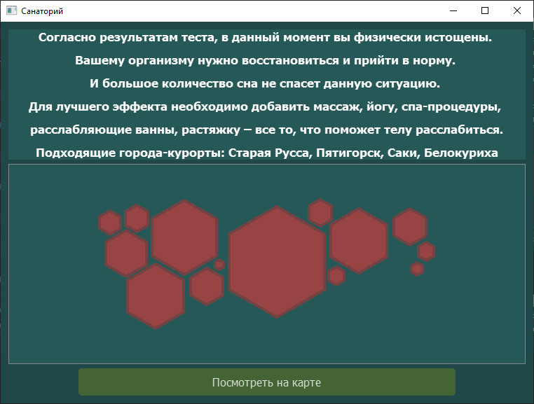
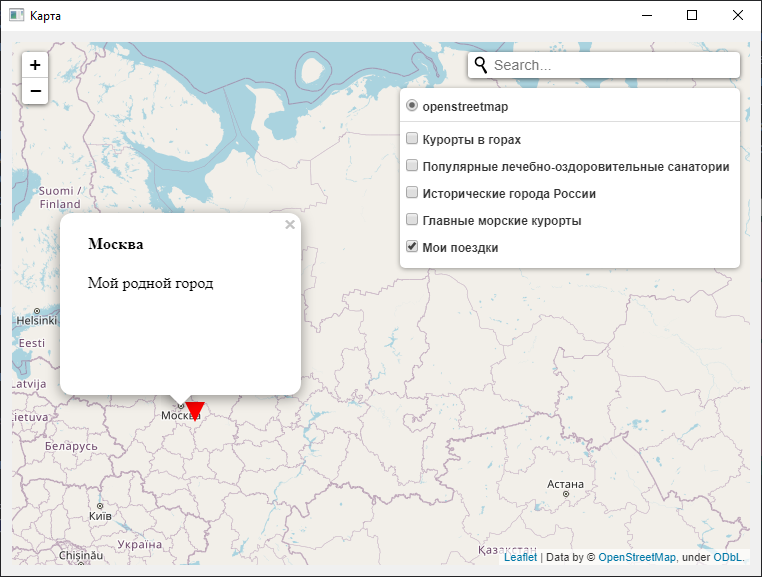

# Тема «Создание приложения для записи маршрутов путешествий»

                                        Автор: Бахман Полина Юрьевна 10 «Б»  
                                        ГБОУ г. Москвы «Школа № 1501»  
                                        Руководители: Анатольев Алексей Владимирович   
                                        (учитель информатики);  
                                        Гаврилова-Драч Юлия Александровна  
                                        (учитель физики)

### Цель проекта
Разработать интерактивную платформу с возможностью прикрепления заметок 
к определенным местам на карте, также просмотра популярных курортов по 
различным критериям и прохождения теста для определения направления отдыха. 


### Общие характеристики проекта
2 базы данных: "base_3.db", "users_data.db"  
16 форм формата 'ui'  
405 строка кода в main.py  
424 строк кода в authorisation.py  
615 строки кода в testing.py  

### Установка и запуск

Для запуска приложения с использованием интерпретатора python рекомендуется использовать python3.9.
Предварительно необходимо установить все внешние библиотеки.

```sh
$ pip install -r requirements.txt
```

### Процесс работы программы

- Главное меню.  
Интерфейс формы состоит из трех функций, выполняющих основные задачи приложения. 
Под каждой из кнопок написан комментарий, описывающий их работу. Также внизу нарисована
карта России из шестиугольников средствами PyQtGraph, части этой карты пользователь может перемещать.


- Нажата кнопка: карта.  
В этом разделе представлена основная карта. Пользователь может 
воспользоваться поиском для нахождения какого-либо города по карте.
Также существуют 4 различные сортировки курортов по следующим 
направлениям: горный, морской, культурный, санаторный отдых.


Для каждой из подборок на карте показаны города с краткими информационными 
справками и фотографиями.


- Нажата кнопка: тест.  
После нажатия этой кнопки пользователь может пройти тест из 10 вопросов
для определения наиболее подходящего отдыха.


После 10-ого вопроса пользователь увидит прогресс бар с обработкой результатов.
Как только прогресс бар покажет 100% выполнения, появится кнопка для просмотра результата.


В результате тестирования пользователю будет предложено одно из 4 направлений.  
Горный отдых


Пляжный отдых


Культурный отдых


Санаторный отдых



- Нажата кнопка: вход  
Здесь пользователь может зарегистрировать свой аккаунт или войти в него 
для создания собственных заметок о путешествиях.


- После осуществления входа пользователю открывается личный кабинет с 
информацией о количестве уже совершенных и записанных поездок, а также 
количеством посещенных городов во время этих путешествий. В личном
кабинете можно также или посмотреть свою карту, или  добавить новую заметку,
или отредактировать существующую.


- Нажата кнопка: Добавить новую поездку.  
Для добавления заметки единственным обязательным полем является указание 
названия места, остальные поля являются дополнительными. 
Название путешествия отвечает за появляющееся окно-подсказку 
при наведении на маркер курсора, а заметка за текст во всплывающем 
окне при нажатии на маркер.


- Нажата кнопка: редактировать прошедшие поездки.  
Для нахождения заметки необходимо вспомнить город, заметку с которым 
пользователь хочет исправить. При существовании других заметок, 
содержащих искомое место, можно несколько раз нажимать на кнопку 
"Найти заметку", чтобы просматривать все найденные заметки. 


- Нажата кнопка: посмотреть свою карту.  
Все загруженные пользователем заметки будут отображаться на карте под
отметкой "Мои поездки". На этой карте можно просмотреть и другие города, 
также как на основной карте.



- При закрытии главного меню, программа завершает работу.

### Ссылка на [**скринкаст**](https://disk.yandex.ru/d/NQabiZguWsgxAQ)


